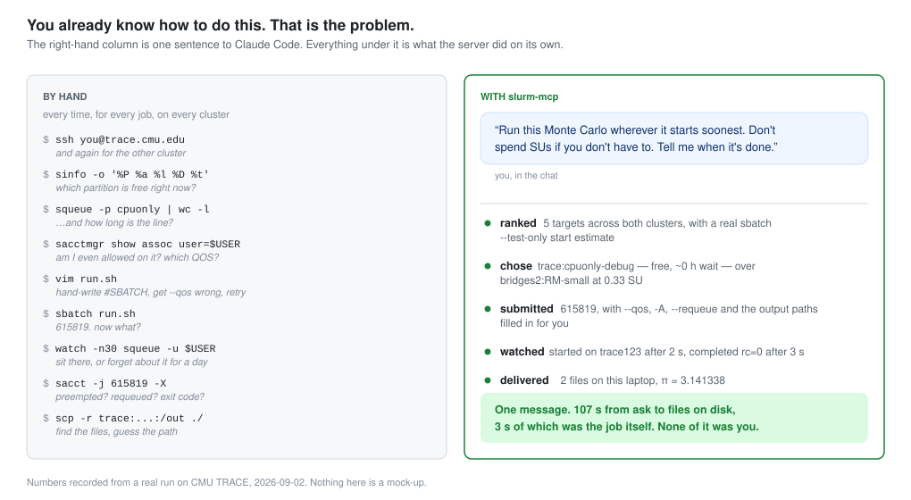
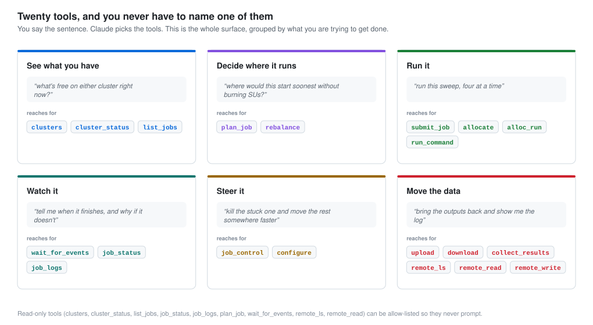
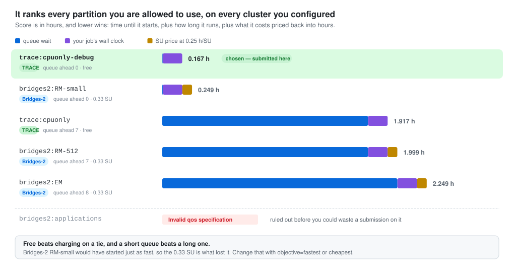
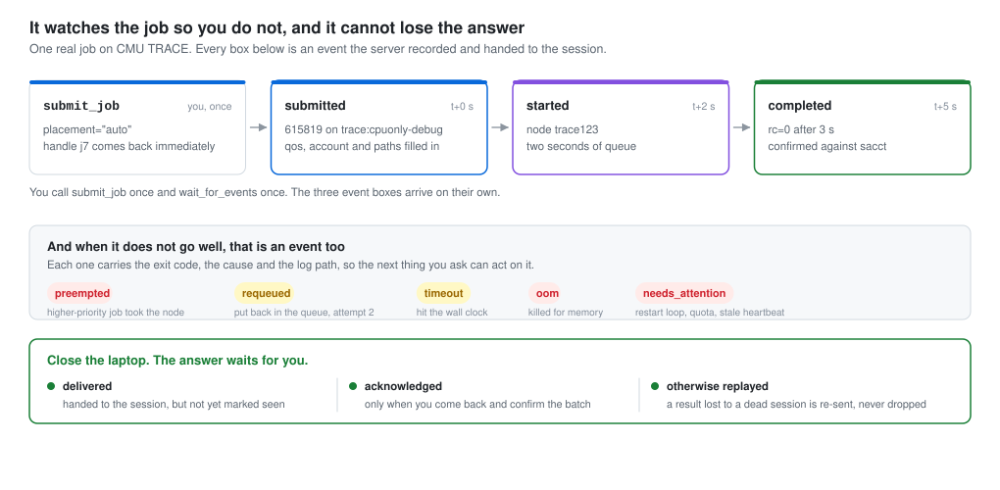
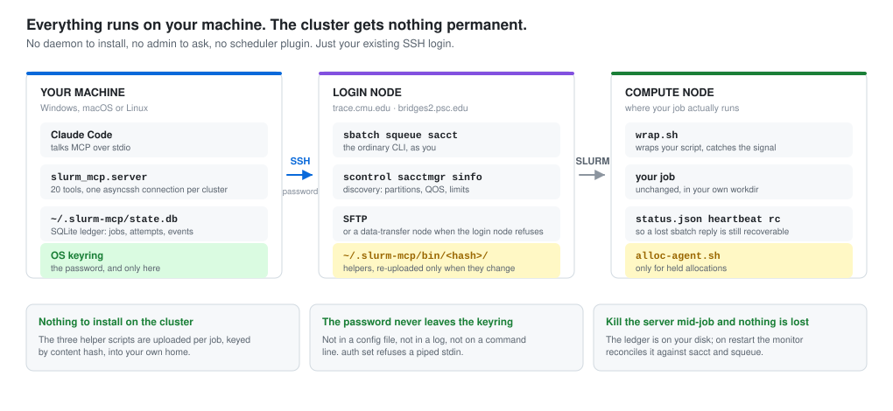

# slurm-mcp

Talk to your SLURM clusters in English from a Claude Code session. Provision compute, submit jobs, balance
them across partitions and clusters by wait time and cost, get told when they finish or fail, and pull the
results back — over nothing but the SSH login you already have.

It is general to any SSH-reachable SLURM cluster: give it a hostname, a username and a password and it
discovers partitions, QOS, accounts, charging, quotas and preemption policy for itself.



Verified against **CMU TRACE** and **PSC Bridges-2** (both SLURM 22.05.11): connection, discovery, quota and
placement on both; the full submit → monitor → logs → collect loop and held allocations on TRACE. Every
number in the figures is from a recorded run on 2026-09-02.

---

## What you can ask for

You never name a tool. You say what you want; Claude picks from the twenty.



---

## Setting it up

```
git clone https://github.com/WenzhuoXu/slurm-mcp.git
cd slurm-mcp
uv venv .venv
uv pip install --python .venv/Scripts/python.exe -e ".[dev]"
```

Add a cluster and store its password:

```
.venv/Scripts/slurm-mcp cluster add mycluster --host login.example.edu --user me
.venv/Scripts/slurm-mcp auth set mycluster
.venv/Scripts/slurm-mcp test mycluster
```

`auth set` prompts at your own terminal and stores the password in the OS keyring. It refuses to read from a
pipe, so nothing else can feed it one, and the password never reaches a config file, a log or a command line.
Useful extras on `cluster add`: `--data-host` (a dedicated transfer node), `--remote-root` (where work goes),
`--account`, `--partition`.

Register the server with Claude Code:

```
claude mcp add slurm --scope user -- /path/to/slurm-mcp/.venv/Scripts/python.exe -m slurm_mcp.server
```

Use `claude mcp add`, **not** `claude_desktop_config.json`. Servers listed there are proxied by the desktop
app's MCP bridge, which applies a fixed four-minute timeout, sends no progress token and drops late results.
The CLI client has none of those limits and moves long calls to the background instead.

To stop the read-only tools prompting, add them to `permissions.allow`: `mcp__slurm__clusters`,
`mcp__slurm__cluster_status`, `mcp__slurm__list_jobs`, `mcp__slurm__job_status`, `mcp__slurm__job_logs`,
`mcp__slurm__remote_ls`, `mcp__slurm__remote_read`, `mcp__slurm__wait_for_events`, `mcp__slurm__plan_job`.

---

## How it decides where to run

`plan_job` ranks every partition you are entitled to use across every cluster you configured, takes a real
`sbatch --test-only` start estimate for the best few, prices a run in SUs, and explains each score. Nothing is
submitted and nothing is charged.



Tune it with `configure(placement={...})`:

| knob | effect |
|---|---|
| `objective` | `balanced` (default, 0.25 h per SU), `fastest` (0.02), `cheapest` (2.0) |
| `su_reserve` | SUs never spent by automatic placement (default 50) |
| `max_running_per_target` | etiquette cap, e.g. `{"trace:biosimmlab*": 1}` |
| `targets_allow` / `targets_deny` | globs on target keys |
| `prefer_cluster` | tie-break toward one cluster |
| `rebalance.min_gain_h` | how much sooner a move must start before it happens |

A job asking for no GPUs is never auto-placed on a GPU partition. Name the partition explicitly if you want
one.

---

## What happens while you are away



`wait_for_events` blocks for as long as you like. Claude Code moves it to the background after two minutes and
returns the result as a notification, so *"tell me when it's done"* is a thing you can actually say. Events
are only consumed when you acknowledge them, so an answer that arrives while your laptop is shut is replayed
rather than lost.

Windows toasts reach you directly; `configure(notify={...})` adds a webhook or turns on SLURM mail.

---

## What actually runs where



---

## Holding a node

For a series of short commands, queueing each one is the wrong shape. `allocate` reserves a node and parks an
agent on it; `alloc_run` fires commands at that node — not at the login node — each with its own id, exit code
and saved output. `idle_release_min` makes the allocation end itself so it stops charging if you wander off.

Because the agent reads a file queue rather than holding an `srun` channel, commands survive a dropped
connection, a server restart and a sleeping laptop.

<details>
<summary>What a tool result actually looks like</summary>

Every tool returns a one-line `summary`, a `next` suggestion and the structured detail. This is the real
result of `alloc_run` against TRACE:

```json
{
  "summary": "a10.c1 finished rc=0 in 5s",
  "next": null,
  "cmd_id": "a10.c1",
  "alloc_id": "a10",
  "state": "done",
  "rc": 0,
  "out_tail": "trace123.wec.local.cmu.edu\n4\n              total        used        free\nMem:            755           3         545",
  "seconds": 4.5,
  "out_path": "/trace/group/biosimmlab/wxu2/.slurm-mcp/jobs/a10/a1/cmds/001.out"
}
```

</details>

---

## Troubleshooting

| symptom | cause and fix |
|---|---|
| `E_AUTH` | no password stored, or it changed. `slurm-mcp auth set <cluster>` in your own terminal |
| `E_UNREACHABLE` on TRACE | off campus without the VPN. Connect Cisco Secure Client to `vpn.cmu.edu` |
| `E_HOSTKEY` | the host key changed for an address seen before. Confirm with the site, then `slurm-mcp hostkeys forget <cluster>` |
| `E_QUOTA` | the destination is full. The message names the free space and your five largest files |
| `E_QOS` on Bridges-2 | that partition needs an explicit QOS; the server picks one, but `RM*` needs `--qos=low` without an RM allocation |
| `E_SCRIPT` | a `script` must begin with `#!`; use `command` for a one-liner |
| `E_ALLOC_NOT_READY` | the allocation is still queued. Wait for the `alloc_ready` event |
| SFTP refused on a login node | expected on Bridges-2. File work is routed to `data.bridges2.psc.edu` automatically |
| a job is stuck `SUBMITTING` | the reply to `sbatch` was lost. The monitor confirms it from the job comment; never resubmit by hand |

---

## Layout

`src/slurm_mcp/` holds the server: `transport.py` (asyncssh), `slurm/` (command builders, parsers,
discovery), `store.py` (SQLite ledger), `monitor.py` (reconciliation), `submitter.py`, `placer.py`,
`transfer.py`, `alloc.py`, `tools/` (the twenty tools) and `helpers/` (the three scripts that run inside your
jobs). `docs/design.md` is the full contract; `docs/clusters.md` records what the two real clusters actually
do.

Tests: `.venv/Scripts/pytest -q tests`. A fake SLURM under `tests/fakeslurm/` replays recorded output from
both real clusters, so the parsers are tested against what those sites actually print rather than against
invented text.

The figures are generated, not drawn by hand — `docs/img/` is built from recorded runs.
