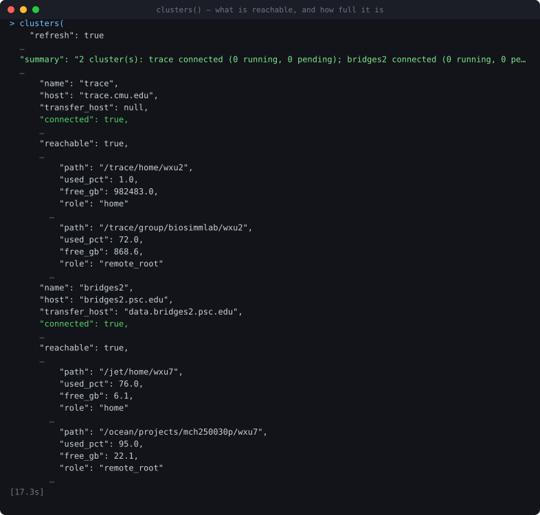
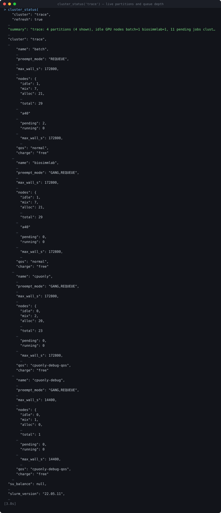
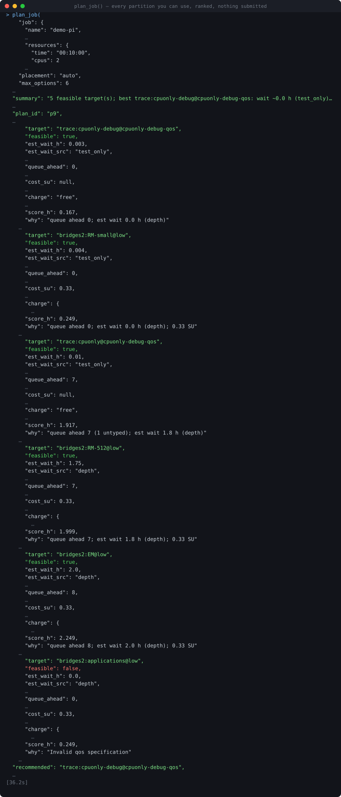
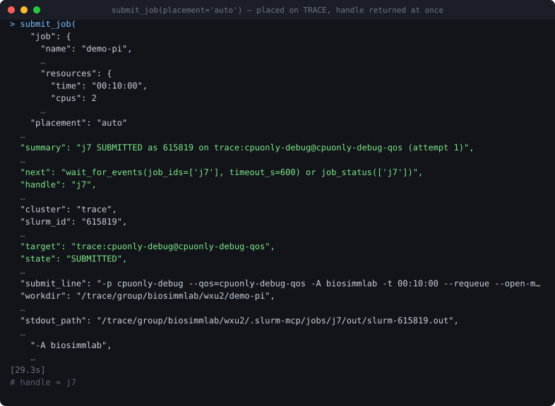
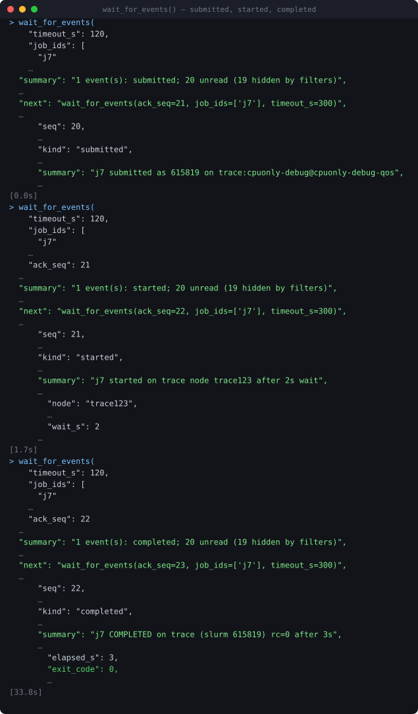
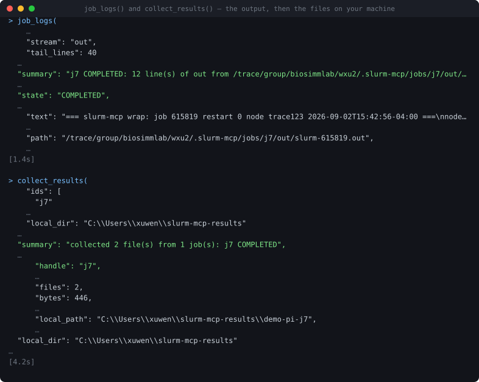
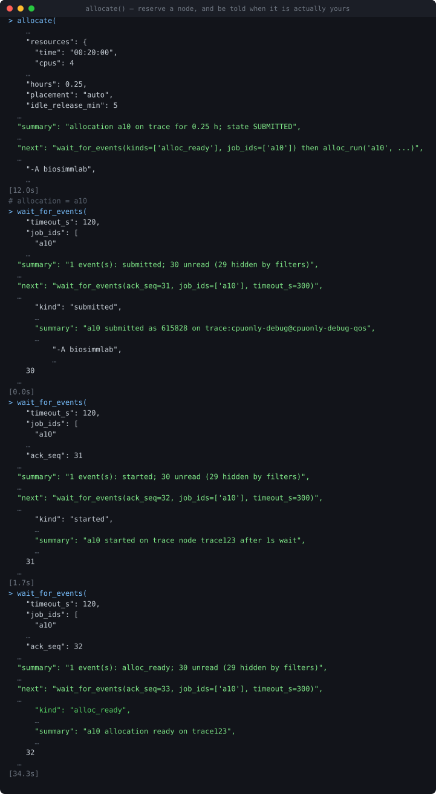
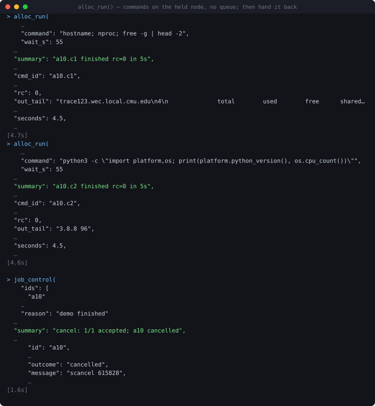

# slurm-mcp

Drive SLURM clusters over SSH from a Claude Code session: provision compute, submit jobs, watch the queue,
balance work across partitions and clusters, get told when things finish or fail, and pull the results back.

It is general to any SSH-reachable SLURM cluster — give it a hostname, a username and a password and it
discovers partitions, QOS, accounts, charging, quotas and preemption policy for itself. Nothing is hardcoded
about a particular site.

Verified against **CMU TRACE** and **PSC Bridges-2** (both SLURM 22.05.11): connection, discovery, quota and
placement on both; the full submit → monitor → logs → collect loop and held allocations on TRACE. Every
transcript below is a recording of a real call against those clusters, not a mock-up — lines were only ever
*removed*, and each removal shows as a `…`.

---

## What it looks like

Twenty tools are exposed. A session normally walks the same path: see what you have, plan, submit, wait,
collect.

### 1. What is reachable, and how full it is

`clusters()` opens both connections in parallel and reports quota per filesystem, so you learn you are at 95 %
on `/ocean` *before* a transfer fails rather than after.



### 2. What you can actually run on

`cluster_status()` is the provisioning view: live node counts per partition, how deep the queue is, the wall
limit, which QOS applies and whether the partition charges.



### 3. Plan before you spend anything

`plan_job()` ranks every partition you are entitled to use **across every configured cluster**, gets a real
`sbatch --test-only` start estimate for the best few, prices one run in SUs, and says why each option scored
what it did. Nothing is submitted and nothing is charged.

Here it put TRACE's free debug partition first at a ~0 h wait, Bridges-2's `RM-small` second at 0.33 SU, and
marked `bridges2:applications` infeasible because that partition rejects the QOS.



### 4. Submit, auto-placed

`submit_job(placement="auto")` takes the top target. It returns the handle `j7` as soon as the intent is
recorded in the ledger — upload, render and `sbatch` continue server-side — and it shows you the exact
`sbatch` line it built, including everything it injected on your behalf.



### 5. Watch it, without polling

`wait_for_events()` blocks until something actually happens. Claude Code moves the call to the background
after two minutes and delivers the result as a notification, so this is how you say *"tell me when it's done"*
and go away.

Events are delivered until you acknowledge them: pass the previous result's `next_seq` as `ack_seq`. A result
lost to a closed laptop is replayed, not dropped.



### 6. Read the output, take the files



### 7. Or hold a node and work on it interactively

`allocate()` reserves a node and parks an agent on it, so a series of short commands skip the queue entirely.
The `alloc_ready` event fires when the node is genuinely yours.



`alloc_run()` then fires commands at that node — not at the login node — each with its own id, exit code and
saved output. `idle_release_min` makes the allocation end itself so it stops charging if you wander off.



---

## Install

```
git clone https://github.com/WenzhuoXu/slurm-mcp.git
cd slurm-mcp
uv venv .venv
uv pip install --python .venv/Scripts/python.exe -e ".[dev]"
```

## Add a cluster

```
.venv/Scripts/slurm-mcp cluster add mycluster --host login.example.edu --user me
.venv/Scripts/slurm-mcp auth set mycluster
.venv/Scripts/slurm-mcp test mycluster
```

`auth set` prompts at your terminal and stores the password in the OS keyring (Windows Credential Manager).
It refuses to read from a pipe, so nothing else can feed it a password, and the password never appears in a
config file, a log or a command line. Useful extras on `cluster add`: `--data-host` (a dedicated transfer
node), `--remote-root` (where work goes), `--account`, `--partition`.

## Register with Claude Code

```
claude mcp add slurm --scope user -- /path/to/slurm-mcp/.venv/Scripts/python.exe -m slurm_mcp.server
```

Register it with `claude mcp add`, **not** in `claude_desktop_config.json`. Servers listed there are proxied
by the desktop app's own MCP bridge, which applies a fixed four-minute timeout, sends no progress token, and
drops late results; the CLI client has none of those limits and moves long calls to the background instead.

If you use a project `.mcp.json` instead, give the server room for the long-poll:

```json
{"mcpServers": {"slurm": {"type": "stdio",
  "command": "C:\\path\\to\\slurm-mcp\\.venv\\Scripts\\python.exe",
  "args": ["-m", "slurm_mcp.server"], "timeout": 900000}}}
```

To skip approval prompts on the read-only tools, add them to `permissions.allow`:
`mcp__slurm__clusters`, `mcp__slurm__cluster_status`, `mcp__slurm__list_jobs`, `mcp__slurm__job_status`,
`mcp__slurm__job_logs`, `mcp__slurm__remote_ls`, `mcp__slurm__remote_read`, `mcp__slurm__wait_for_events`,
`mcp__slurm__plan_job`.

## The twenty tools

| group | tools |
|---|---|
| clusters | `clusters`, `cluster_status`, `run_command` |
| jobs | `submit_job`, `list_jobs`, `job_status`, `job_logs`, `job_control` |
| placement | `plan_job`, `rebalance` |
| events | `wait_for_events` |
| files | `remote_ls`, `remote_read`, `remote_write` |
| transfers | `upload`, `download`, `collect_results` |
| allocations | `allocate`, `alloc_run` |
| config | `configure` |

## How it picks a target

Lower is better, in hours: estimated wait, plus the job's own wall clock, plus expected rework if the
partition can preempt it, plus the SU cost weighted by `objective` (`balanced` 0.25 h per SU, `fastest` 0.02,
`cheapest` 2.0), plus an etiquette penalty when you already have jobs running there. Free clusters therefore
win ties over charging ones, and a long queue loses to a short one. Tune it with `configure(placement={...})`:

| knob | effect |
|---|---|
| `objective` | `balanced` (default), `fastest`, `cheapest` |
| `su_reserve` | SUs never spent by automatic placement (default 50) |
| `max_running_per_target` | etiquette cap, e.g. `{"trace:biosimmlab*": 1}` |
| `targets_allow` / `targets_deny` | globs on target keys |
| `prefer_cluster` | tie-break toward one cluster |
| `rebalance.min_gain_h` | how much sooner a move must start before it happens |

A job asking for no GPUs is never auto-placed on a GPU partition. Name the partition explicitly if you want
it.

## Notifications

Terminal states, preemption, requeues and failures become durable events. `wait_for_events` delivers them and
only marks them seen when you acknowledge, so a result lost to a closed session is replayed rather than
dropped. Windows toasts go to you directly; `configure(notify={...})` adds a webhook or turns on SLURM mail.

## Troubleshooting

| symptom | cause and fix |
|---|---|
| `E_AUTH` | no password stored, or it changed. `slurm-mcp auth set <cluster>` in your own terminal |
| `E_UNREACHABLE` on TRACE | off campus without the VPN. Connect Cisco Secure Client to `vpn.cmu.edu` |
| `E_HOSTKEY` | the host key changed for an address seen before. Confirm with the site, then `slurm-mcp hostkeys forget <cluster>` |
| `E_QUOTA` | the destination is full. The message names the free space and your five largest files |
| `E_QOS` on Bridges-2 | that partition needs an explicit QOS; the server picks one, but `RM*` needs `--qos=low` without an RM allocation |
| `E_SCRIPT` | a `script` must begin with `#!`; use `command` for a one-liner |
| SFTP refused on a login node | expected on Bridges-2. File work is routed to `data.bridges2.psc.edu` automatically |
| a job is stuck `SUBMITTING` | the reply to `sbatch` was lost. The monitor confirms it from the job comment; never resubmit by hand |

## Layout

`src/slurm_mcp/` holds the server: `transport.py` (asyncssh), `slurm/` (command builders, parsers,
discovery), `store.py` (SQLite ledger), `monitor.py` (reconciliation), `submitter.py`, `placer.py`,
`transfer.py`, `alloc.py`, `tools/` (the 20 MCP tools) and `helpers/` (the three scripts that run inside your
jobs). `docs/design.md` is the full contract; `docs/clusters.md` records what the two real clusters actually
do.

Tests: `.venv/Scripts/pytest -q tests` — about four minutes, no cluster needed. A fake SLURM under
`tests/fakeslurm/` replays recorded output from both real clusters, so the parsers are tested against what
those sites actually print.
